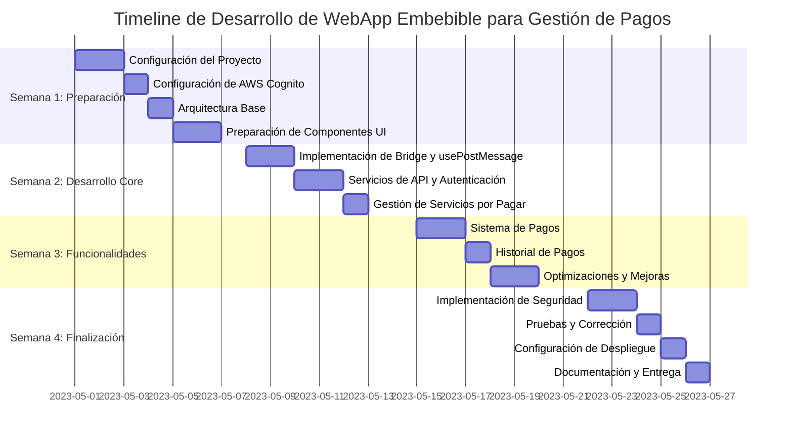

# Plan de Desarrollo - WebApp Embebible para Gestión de Pagos

## Descripción del Problema

### Problema General
Los usuarios necesitan una forma conveniente y segura de visualizar y pagar sus servicios pendientes directamente desde diferentes sitios web sin tener que salir de ellos para completar sus transacciones. Las empresas que ofrecen estos servicios requieren una solución que puedan integrar fácilmente en sus propias plataformas web, manteniendo su identidad visual y controlando la experiencia del usuario.

Este widget embebible busca resolver ese problema permitiendo:
- A los usuarios: ver una lista de sus servicios pendientes de pago y realizar los pagos sin cambiar de contexto.
- A las empresas: integrar fácilmente esta funcionalidad en sus sitios web, personalizar la apariencia según su marca y recibir notificaciones en tiempo real sobre los pagos realizados.

### Problemas Específicos a Resolver

#### 1. Seguridad en Entorno Embebido
Uno de los principales desafíos es garantizar la seguridad de las transacciones financieras dentro de un iframe, donde existen riesgos específicos:
- **Ataques de clickjacking**: Sitios maliciosos podrían embeber el widget y manipular la interacción del usuario.
- **Fuga de información sensible**: Los datos de tarjetas y credenciales podrían ser interceptados.
- **Falsificación de solicitudes**: Un sitio no autorizado podría intentar procesar pagos fraudulentos.

**Solución propuesta**: Implementaremos verificación estricta de origen, comunicación segura mediante postMessage con validación de origen, manejo seguro de tokens y una política de CORS restrictiva que solo permita embeber el widget desde dominios autorizados.

#### 2. Experiencia de Usuario Inconsistente
Los widgets embebidos suelen tener problemas de integración visual y funcional con el sitio host:
- **Discrepancia de estilos**: El widget puede verse desconectado visualmente del resto del sitio.
- **Problemas de redimensionamiento**: Los iframes tienen altura fija, lo que genera barras de desplazamiento innecesarias o espacio en blanco.
- **Falta de retroalimentación entre sistemas**: El sitio host no recibe información sobre las acciones realizadas en el widget.

**Solución propuesta**: Desarrollaremos un sistema de temas dinámicos basado en Tailwind, un mecanismo automático de redimensionamiento del iframe y un protocolo de comunicación bidireccional robusto mediante postMessage para sincronizar estados y notificar eventos importantes.

## 1. Arquitectura General

### 1.1 Estructura de Archivos
```
payment-widget/
├── public/
│   ├── index.html          # Página principal para desarrollo/pruebas
│   ├── embed.html          # Página de ejemplo para embeber
│   └── favicon.ico
├── src/
│   ├── assets/             # Imágenes, iconos, etc.
│   ├── components/         # Componentes reutilizables
│   │   ├── ui/             # Componentes de UI (Button, Card, etc.)
│   │   └── features/       # Componentes específicos de características
│   │       ├── auth/       # Componentes de autenticación
│   │       ├── payments/   # Componentes relacionados con pagos
│   │       └── services/   # Componentes de servicios por pagar
│   ├── config/             # Configuraciones (API URLs, constantes, etc.)
│   │   └── cognito.ts      # Configuración de Amazon Cognito
│   ├── context/            # Context API para manejo de estado global
│   │   └── ConfigContext.tsx # Contexto para configuración del widget
│   ├── hooks/              # Custom hooks
│   │   ├── useServices.ts  # Hook para servicios con React Query
│   │   └── usePostMessage.ts # Hook para comunicación con host
│   ├── services/           # Servicios de comunicación con API
│   │   ├── api.ts          # Cliente base para API
│   │   ├── auth.ts         # Servicios de autenticación con Cognito
│   │   └── payments.ts     # Servicios de pagos
│   ├── utils/              # Utilidades generales
│   │   ├── formatters.ts   # Formateadores (fechas, moneda)
│   │   └── validators.ts   # Validadores
│   ├── App.tsx             # Componente principal
│   ├── index.tsx           # Punto de entrada
│   ├── bridge.ts           # Módulo de comunicación con host
│   └── styles.css          # Estilos globales
├── .env                    # Variables de entorno para desarrollo
├── .env.production         # Variables de entorno para producción
├── package.json
├── README.md
└── vite.config.ts          # Configuración personalizada para embebible
```

### 1.2 Tecnologías a Usar
- **React 18+**: Para UI y lógica frontend
- **TypeScript**: Para tipado estático y mejor mantenibilidad del código
- **Tailwind CSS**: Para estilos utilitarios y configuración de temas
- **shadcn/ui**: Para componentes UI reutilizables y accesibles
- **Axios**: Para comunicación con API
- **React Query**: Para fetching, caché y manejo de estado del servidor
- **Zustand**: Para manejo de estado global (alternativa liviana a Redux)
- **Jest + React Testing Library**: Para pruebas
- **ESLint + Prettier**: Para linting y formato de código
- **Vite**: Para desarrollo rápido y construcción optimizada
- **Express.js**: Para el servidor de desarrollo y proxy de API (opcional)

### 1.3 Dependencias Recomendadas
```json
{
  "dependencies": {
    "react": "^18.2.0",
    "react-dom": "^18.2.0",
    "axios": "^1.5.0",
    "@tanstack/react-query": "^4.35.3",
    "zustand": "^4.4.1",
    "class-variance-authority": "^0.7.0",
    "clsx": "^2.0.0",
    "tailwind-merge": "^1.14.0",
    "dayjs": "^1.11.9",
    "zod": "^3.22.2",
    "@radix-ui/react-dialog": "^1.0.5",
    "@radix-ui/react-label": "^2.0.2",
    "@radix-ui/react-select": "^1.2.2",
    "lucide-react": "^0.265.0",
    "express": "^4.18.2",
    "cors": "^2.8.5",
    "helmet": "^7.0.0",
    "aws-amplify": "^5.3.10"
  },
  "devDependencies": {
    "vite": "^4.4.9",
    "@vitejs/plugin-react": "^4.0.4",
    "typescript": "^5.2.2",
    "@types/react": "^18.2.21",
    "@types/react-dom": "^18.2.7",
    "@types/express": "^4.17.18",
    "@types/cors": "^2.8.14",
    "jest": "^29.6.4",
    "@testing-library/react": "^14.0.0",
    "@testing-library/jest-dom": "^6.1.3",
    "eslint": "^8.49.0",
    "prettier": "^3.0.3",
    "autoprefixer": "^10.4.15",
    "postcss": "^8.4.28",
    "tailwindcss": "^3.3.3",
    "tailwindcss-animate": "^1.0.7",
    "ts-node": "^10.9.1"
  }
}
```

## 2. Especificaciones de Comunicación entre WebApp y Sitio Host

### 2.1 Protocolo de Comunicación: postMessage
La comunicación entre el iframe (WebApp) y la página host se realizará mediante el API postMessage, permitiendo una comunicación bidireccional segura.

### 2.2 Eventos del Host al Widget
```javascript
// Inicialización con configuración
{
  type: 'INIT',
  payload: {
    theme: 'light' | 'dark',
    size: 'compact' | 'full',
    userId: 'string', // ID de usuario para autenticación
    token: 'string',  // Token JWT para autenticación
    environment: 'development' | 'production',
    allowedServices: ['electric', 'water', 'internet'] // Servicios permitidos
  }
}

// Actualización de configuración
{
  type: 'UPDATE_CONFIG',
  payload: {
    theme: 'light' | 'dark',
    size: 'compact' | 'full'
  }
}

// Solicitar actualización de datos
{
  type: 'REFRESH_DATA'
}

// Logout forzado
{
  type: 'LOGOUT'
}
```

### 2.3 Eventos del Widget al Host
```javascript
// Widget listo para recibir mensajes
{
  type: 'READY'
}

// Notificación de cambio de altura para ajustar iframe
{
  type: 'RESIZE',
  payload: {
    height: number
  }
}

// Evento de pago realizado
{
  type: 'PAYMENT_COMPLETED',
  payload: {
    transactionId: 'string',
    amount: number,
    serviceId: 'string',
    timestamp: 'ISO-date'
  }
}

// Solicitud de autenticación
{
  type: 'AUTH_REQUIRED'
}

// Error en el widget
{
  type: 'ERROR',
  payload: {
    code: 'string',
    message: 'string'
  }
}
```

### 2.4 Hook para comunicación con postMessage

El hook `usePostMessage` proporciona una forma elegante de manejar la comunicación bidireccional:

```typescript
// src/hooks/usePostMessage.ts
import { useEffect, useCallback, useState, RefObject } from 'react';
import bridge, { WidgetMessage } from '../bridge';

/**
 * Tipo de función para manejar mensajes del host
 */
export type MessageHandler<T = any> = (payload: T) => void;

/**
 * Tipo de función para enviar mensajes al host
 */
export type PostMessageFunction<T = any> = (type: string, payload?: T) => void;

/**
 * Hook para manejar la comunicación bidireccional con el sitio host
 * a través del API postMessage.
 */
export function usePostMessage(
  messageHandlers: Record<string, MessageHandler> = {}
): [PostMessageFunction, boolean] {
  const [isReady, setIsReady] = useState(false);

  // Registrar handlers y limpieza
  useEffect(() => {
    // Código de registro de handlers
    // ...

    return () => {
      // Limpieza de handlers
      // ...
    };
  }, [messageHandlers]);

  // Función para enviar mensajes al host
  const sendToHost = useCallback<PostMessageFunction>((type, payload = {}) => {
    bridge.sendToHost(type, payload);
  }, []);

  return [sendToHost, isReady];
}

/**
 * Hook especializado para manejar el redimensionamiento automático
 * del iframe basado en el contenido
 */
export function useAutoResize(ref: RefObject<HTMLElement>): void {
  // Implementación
}

// Otros hooks especializados...
```

### 2.5 Implementación Base de Bridge
```typescript
// src/bridge.ts
export interface WidgetMessage {
  type: string;
  payload?: any;
}

export interface WidgetEventListener {
  (payload: any): void;
}

export class WidgetBridge {
  private eventListeners: Record<string, WidgetEventListener[]>;
  private hostOrigin: string;
  private allowedOrigins: string[];

  constructor(allowedOrigins: string[] = []) {
    this.eventListeners = {};
    this.hostOrigin = '*'; // Se debe configurar con orígenes permitidos
    this.allowedOrigins = allowedOrigins;

    // Escuchar mensajes del host
    window.addEventListener('message', this.handleMessage.bind(this));
  }

  public init(): void {
    // Notificar al host que está listo
    this.sendToHost('READY');
  }

  private handleMessage(event: MessageEvent): void {
    // Validar origen en producción
    if (this.allowedOrigins.length && !this.allowedOrigins.includes(event.origin)) {
      console.error(`Mensaje rechazado de origen no permitido: ${event.origin}`);
      return;
    }

    const { type, payload } = event.data as WidgetMessage;
    
    if (this.eventListeners[type]) {
      this.eventListeners[type].forEach(callback => callback(payload));
    }
  }

  public on(eventType: string, callback: WidgetEventListener): void {
    if (!this.eventListeners[eventType]) {
      this.eventListeners[eventType] = [];
    }
    this.eventListeners[eventType].push(callback);
  }

  public off(eventType: string, callback?: WidgetEventListener): void {
    if (!this.eventListeners[eventType]) return;
    
    if (callback) {
      // Eliminar solo el callback específico
      this.eventListeners[eventType] = this.eventListeners[eventType].filter(
        listener => listener !== callback
      );
    } else {
      // Eliminar todos los callbacks para este tipo de evento
      delete this.eventListeners[eventType];
    }
  }

  public sendToHost(type: string, payload: any = {}): void {
    window.parent.postMessage({ type, payload } as WidgetMessage, this.hostOrigin);
  }

  // Métodos específicos para eventos comunes
  public resize(height: number): void {
    this.sendToHost('RESIZE', { height });
  }

  public notifyPayment(paymentData: {
    transactionId: string;
    amount: number;
    serviceId: string;
    timestamp: string;
  }): void {
    this.sendToHost('PAYMENT_COMPLETED', paymentData);
  }

  public reportError(code: string, message: string): void {
    this.sendToHost('ERROR', { code, message });
  }
}

export default new WidgetBridge();
```

## 3. Diseño de la API para Integración con AWS

### 3.1 Arquitectura de API en AWS
- **API Gateway**: Front-end para todas las peticiones API
- **Lambda Functions**: Lógica de negocio para cada endpoint
- **DynamoDB**: Base de datos para información de servicios y transacciones
- **Amazon Cognito**: Para autenticación, autorización y gestión de usuarios
- **S3**: Para almacenamiento de logs y reportes
- **CloudWatch**: Para monitoreo y alertas

La gestión de usuarios y autenticación se implementará utilizando Amazon Cognito, lo que proporcionará:
- Registro y confirmación de usuarios con verificación por correo/SMS
- Login seguro con multifactor authentication (MFA) opcional
- Tokens JWT estándar (ID, Access y Refresh tokens)
- Federación con proveedores de identidad social (Google, Facebook, etc.)
- Flujos personalizados de autenticación mediante Lambda Triggers
- Control de acceso basado en grupos y roles

### 3.2 Esquema de Endpoints

#### 3.2.1 Autenticación
La autenticación se gestionará directamente con Amazon Cognito, utilizando su SDK en el frontend y flujos de autenticación estándar. Los endpoints de autenticación y gestión de sesiones no serán necesarios en nuestra API, ya que Cognito proporciona estos servicios directamente.

Amazon Cognito manejará:
- Inicio de sesión de usuarios
- Registro de nuevos usuarios
- Verificación de email/teléfono
- Reset de contraseñas
- Refresh de tokens
- Cierre de sesión

Todos los tokens JWT generados por Cognito serán utilizados para autenticar las solicitudes a los endpoints de nuestra API a través de API Gateway.

#### 3.2.2 Servicios por Pagar
```
GET /services
  - Headers: { Authorization: Bearer <token> }
  - Query Params: { status, serviceType, limit, offset }
  - Response: { 
      items: [
        { id, serviceType, description, amount, dueDate, status }
      ], 
      total, offset, limit 
    }

GET /services/:id
  - Headers: { Authorization: Bearer <token> }
  - Response: { 
      id, serviceType, description, amount, dueDate, status,
      details: { ... información detallada ... }
    }
```

#### 3.2.3 Pagos
```
POST /payments
  - Headers: { Authorization: Bearer <token> }
  - Payload: { 
      serviceId, amount, paymentMethod, 
      cardDetails?: { number, expiry, cvv, holderName } 
    }
  - Response: { 
      transactionId, status, timestamp, 
      receipt: { url } 
    }

GET /payments
  - Headers: { Authorization: Bearer <token> }
  - Query Params: { status, serviceId, fromDate, toDate, limit, offset }
  - Response: { 
      items: [
        { id, serviceId, amount, status, timestamp }
      ], 
      total, offset, limit 
    }

GET /payments/:id
  - Headers: { Authorization: Bearer <token> }
  - Response: { 
      id, serviceId, amount, status, timestamp,
      service: { type, description },
      receipt: { url }
    }
```

### 3.3 Estructura Lambda + API Gateway

Cada endpoint se implementará como una función Lambda separada siguiendo principios de arquitectura serverless:

```
/services
  - GET: getServicesFunction
  - GET /{id}: getServiceDetailFunction
/payments
  - POST: createPaymentFunction
  - GET: getPaymentsFunction
  - GET /{id}: getPaymentDetailFunction
```

La autenticación se configurará a nivel de API Gateway mediante un Authorizer de Cognito, que validará automáticamente los tokens JWT generados por Cognito y rechazará las solicitudes no autorizadas.

### 3.4 Ejemplo de Payload para Lambda

#### Request para crear un pago:
```json
{
  "serviceId": "srv-123456",
  "amount": 56.78,
  "paymentMethod": "credit_card",
  "cardDetails": {
    "number": "4111111111111111",
    "expiry": "12/25",
    "cvv": "123",
    "holderName": "John Doe"
  }
}
```

#### Response exitosa:
```json
{
  "transactionId": "tx-987654",
  "status": "completed",
  "timestamp": "2023-09-15T14:35:42Z",
  "receipt": {
    "url": "https://api.example.com/receipts/tx-987654.pdf"
  }
}
```

## 4. Estrategia de Manejo de Estado en React

### 4.1 Arquitectura de Estado
Implementaremos una estrategia de manejo de estado híbrida:

1. **Estado Local de Componentes**: Para datos específicos de UI
2. **React Query**: Para estado del servidor y caché
3. **Zustand**: Para estado global de la aplicación
4. **Context API**: Para configuración de la aplicación
5. **Tailwind con modo oscuro**: Para manejo de temas usando clases dark:

### 4.2 Estado Global con Zustand
```typescript
// src/store/paymentStore.ts
import { create } from 'zustand';
import { paymentService, PaymentResult } from '../services/payments';

interface Service {
  id: string;
  serviceType: string;
  description: string;
  amount: number;
  dueDate: string;
  status: 'pending' | 'paid' | 'overdue';
}

interface Payment {
  id: string;
  serviceId: string;
  amount: number;
  status: 'completed' | 'processing' | 'failed';
  timestamp: string;
}

interface PaymentStoreState {
  services: Service[];
  pendingPayments: Payment[];
  completedPayments: Payment[];
  isLoading: boolean;
  error: string | null;
  
  fetchServices: () => Promise<void>;
  payService: (serviceId: string, paymentDetails: any) => Promise<PaymentResult>;
}

export const usePaymentStore = create<PaymentStoreState>((set, get) => ({
  // Estado
  services: [],
  pendingPayments: [],
  completedPayments: [],
  isLoading: false,
  error: null,
  
  // Acciones
  fetchServices: async () => {
    try {
      set({ isLoading: true, error: null });
      const services = await paymentService.getServices();
      set({ services, isLoading: false });
    } catch (error) {
      set({ error: error instanceof Error ? error.message : String(error), isLoading: false });
    }
  },
  
  payService: async (serviceId: string, paymentDetails: any) => {
    try {
      set({ isLoading: true, error: null });
      const result = await paymentService.createPayment(serviceId, paymentDetails);
      
      // Actualizar listas de servicios y pagos
      const services = get().services.map(service => 
        service.id === serviceId 
          ? { ...service, status: 'paid' as const } 
          : service
      );
      
      const completedPayments = [...get().completedPayments, {
        id: result.transactionId,
        serviceId,
        amount: paymentDetails.amount,
        status: 'completed' as const,
        timestamp: result.timestamp
      }];
      
      set({ 
        services, 
        completedPayments,
        isLoading: false 
      });
      
      return result;
    } catch (error) {
      set({ error: error instanceof Error ? error.message : String(error), isLoading: false });
      throw error;
    }
  }
}));
```

### 4.3 Hooks para uso de React Query
```typescript
// src/hooks/useServices.ts
import { useQuery, useMutation, useQueryClient } from '@tanstack/react-query';
import { paymentService, Service, PaymentDetails, PaymentResult } from '../services/payments';

interface ServiceFilters {
  status?: string;
  serviceType?: string;
  limit?: number;
  offset?: number;
}

/**
 * Hook para obtener la lista de servicios por pagar
 */
export function useServices(filters: ServiceFilters = {}) {
  return useQuery<{
    items: Service[];
    total: number;
    offset: number;
    limit: number;
  }, Error>(
    ['services', filters],
    () => paymentService.getServices(filters),
    {
      staleTime: 5 * 60 * 1000, // 5 minutos
      cacheTime: 30 * 60 * 1000, // 30 minutos
    }
  );
}

/**
 * Hook para obtener un servicio específico
 */
export function useServiceDetails(id: string) {
  return useQuery<Service, Error>(
    ['service', id],
    () => paymentService.getServiceDetails(id),
    {
      enabled: !!id, // Solo ejecutar si hay un ID
    }
  );
}

/**
 * Hook para obtener el historial de pagos
 */
export function usePayments(filters: Record<string, any> = {}) {
  return useQuery<{
    items: any[];
    total: number;
    offset: number;
    limit: number;
  }, Error>(
    ['payments', filters],
    () => paymentService.getPayments(filters),
    {
      staleTime: 5 * 60 * 1000,
    }
  );
}

interface PayServiceParams {
  serviceId: string;
  paymentDetails: PaymentDetails;
}

/**
 * Hook para realizar un pago
 */
export function usePayService() {
  const queryClient = useQueryClient();
  
  return useMutation<PaymentResult, Error, PayServiceParams>(
    ({ serviceId, paymentDetails }) => 
      paymentService.createPayment(serviceId, paymentDetails),
    {
      onSuccess: () => {
        // Invalidar consultas relacionadas para forzar refresco
        queryClient.invalidateQueries(['services']);
        queryClient.invalidateQueries(['payments']);
      },
    }
  );
}
```

### 4.4 Context para Configuración
```typescript
// src/context/ConfigContext.tsx
import React, { createContext, useState, useContext, useEffect, ReactNode } from 'react';
import bridge from '../bridge';

interface Config {
  theme: 'light' | 'dark';
  size: 'compact' | 'full';
  userId: string | null;
  token: string | null;
  environment: 'development' | 'production';
  allowedServices: string[];
}

interface ConfigContextType {
  config: Config;
  setConfig: React.Dispatch<React.SetStateAction<Config>>;
}

const ConfigContext = createContext<ConfigContextType | undefined>(undefined);

interface ConfigProviderProps {
  children: ReactNode;
}

export const ConfigProvider: React.FC<ConfigProviderProps> = ({ children }) => {
  const [config, setConfig] = useState<Config>({
    theme: 'light',
    size: 'full',
    userId: null,
    token: null,
    environment: 'development',
    allowedServices: []
  });

  useEffect(() => {
    // Escuchar mensajes de inicialización del host
    bridge.on('INIT', (payload: Partial<Config>) => {
      setConfig(current => ({ ...current, ...payload }));
      
      // Configurar tema de Tailwind
      if (payload.theme === 'dark') {
        document.documentElement.classList.add('dark');
      } else {
        document.documentElement.classList.remove('dark');
      }
    });

    // Escuchar actualizaciones de configuración
    bridge.on('UPDATE_CONFIG', (payload: Partial<Config>) => {
      setConfig(prev => ({ ...prev, ...payload }));
      
      // Actualizar tema si cambia
      if (payload.theme) {
        if (payload.theme === 'dark') {
          document.documentElement.classList.add('dark');
        } else {
          document.documentElement.classList.remove('dark');
        }
      }
    });

    // Informar al host que estamos listos
    bridge.init();

    // Cleanup al desmontar
    return () => {
      bridge.off('INIT');
      bridge.off('UPDATE_CONFIG');
    };
  }, []);

  return (
    <ConfigContext.Provider value={{ config, setConfig }}>
      {children}
    </ConfigContext.Provider>
  );
};

export const useConfig = (): ConfigContextType => {
  const context = useContext(ConfigContext);
  if (context === undefined) {
    throw new Error('useConfig must be used within a ConfigProvider');
  }
  return context;
};
```

## 5. Manejo de Autenticación con AWS Cognito

### 5.1 Estrategia de Autenticación
La aplicación utilizará Amazon Cognito para la autenticación de usuarios, aprovechando sus capacidades de generación y gestión de tokens JWT:

1. El sitio host puede proporcionar los tokens durante la inicialización (si ya tiene una sesión de Cognito activa)
2. Alternativamente, se puede implementar un flujo de inicio de sesión dentro del widget usando Amplify Auth
3. Los tokens se almacenarán en memoria (no localStorage para evitar problemas en iframe)
4. Se utilizará el mecanismo de refresh de tokens de Cognito

### 5.2 Configuración e Inicialización de Cognito

```typescript
// src/config/cognito.ts
import { Amplify, Auth } from 'aws-amplify';

export const configureCognito = (config = {}) => {
  // Configuración base de Cognito
  const cognitoConfig = {
    Auth: {
      region: process.env.REACT_APP_COGNITO_REGION || 'us-east-1',
      userPoolId: process.env.REACT_APP_COGNITO_USER_POOL_ID,
      userPoolWebClientId: process.env.REACT_APP_COGNITO_CLIENT_ID,
      oauth: {
        // Configuración para OAuth si se usa federación
        domain: process.env.REACT_APP_COGNITO_DOMAIN,
        scope: ['email', 'profile', 'openid'],
        redirectSignIn: window.location.origin,
        redirectSignOut: window.location.origin,
        responseType: 'code'
      },
      // Habilitar almacenamiento en memoria para evitar problemas en iframe
      cookieStorage: {
        domain: window.location.hostname,
        path: '/',
        expires: 365,
        secure: process.env.NODE_ENV === 'production'
      },
      // Desactivar almacenamiento en localStorage
      storage: null,
      ...config
    }
  };
  
  // Inicializar Amplify con la configuración
  Amplify.configure(cognitoConfig);
};
```

### 5.3 Servicio de Autenticación con Cognito

```typescript
// src/services/auth.ts
import { Auth } from 'aws-amplify';
import dayjs from 'dayjs';
import bridge from '../bridge';

interface LoginCredentials {
  username: string;
  password: string;
}

interface SignUpParams {
  username: string;
  password: string;
  email: string;
  phone_number?: string;
}

interface AuthTokens {
  idToken: string;
  accessToken: string;
  refreshToken?: string;
  expiresAt: Date;
}

export class AuthService {
  private currentSession: AuthTokens | null = null;

  /**
   * Establece tokens proporcionados externamente (por el host)
   */
  public setExternalTokens(tokens: {
    idToken: string;
    accessToken: string;
    refreshToken?: string;
    expiresIn?: number;
  }): void {
    const expiresIn = tokens.expiresIn || 3600; // 1 hora por defecto
    
    this.currentSession = {
      idToken: tokens.idToken,
      accessToken: tokens.accessToken,
      refreshToken: tokens.refreshToken,
      expiresAt: dayjs().add(expiresIn, 'second').toDate()
    };
  }

  /**
   * Iniciar sesión con Cognito
   */
  public async login(credentials: LoginCredentials): Promise<AuthTokens> {
    try {
      const user = await Auth.signIn(credentials.username, credentials.password);
      
      // Obtener tokens de la sesión actual
      const session = user.signInUserSession;
      
      this.currentSession = {
        idToken: session.idToken.jwtToken,
        accessToken: session.accessToken.jwtToken,
        refreshToken: session.refreshToken.token,
        expiresAt: new Date(session.accessToken.payload.exp * 1000)
      };
      
      return this.currentSession;
    } catch (error) {
      console.error('Error signing in:', error);
      throw error;
    }
  }

  /**
   * Registrar un nuevo usuario
   */
  public async signUp(params: SignUpParams): Promise<any> {
    try {
      return await Auth.signUp({
        username: params.username,
        password: params.password,
        attributes: {
          email: params.email,
          phone_number: params.phone_number
        }
      });
    } catch (error) {
      console.error('Error signing up:', error);
      throw error;
    }
  }

  /**
   * Confirmar registro con código
   */
  public async confirmSignUp(username: string, code: string): Promise<any> {
    try {
      return await Auth.confirmSignUp(username, code);
    } catch (error) {
      console.error('Error confirming sign up:', error);
      throw error;
    }
  }

  /**
   * Refrescar tokens automáticamente
   */
  public async refreshSession(): Promise<AuthTokens> {
    try {
      const cognitoUser = await Auth.currentAuthenticatedUser();
      const currentSession = await Auth.currentSession();
      
      this.currentSession = {
        idToken: currentSession.getIdToken().getJwtToken(),
        accessToken: currentSession.getAccessToken().getJwtToken(),
        refreshToken: currentSession.getRefreshToken().getToken(),
        expiresAt: new Date(currentSession.getAccessToken().getExpiration() * 1000)
      };
      
      return this.currentSession;
    } catch (error) {
      console.error('Error refreshing session:', error);
      this.currentSession = null;
      bridge.sendToHost('AUTH_REQUIRED');
      throw error;
    }
  }

  /**
   * Cerrar sesión
   */
  public async logout(): Promise<void> {
    try {
      await Auth.signOut();
      this.currentSession = null;
    } catch (error) {
      console.error('Error signing out:', error);
      throw error;
    }
  }

  /**
   * Verificar si el usuario está autenticado
   */
  public isAuthenticated(): boolean {
    return !!this.currentSession?.accessToken && 
           !!this.currentSession?.expiresAt && 
           dayjs().isBefore(this.currentSession.expiresAt);
  }

  /**
   * Obtener el token de acceso
   */
  public getAccessToken(): string | null {
    if (this.isAuthenticated()) {
      return this.currentSession?.accessToken || null;
    }
    return null;
  }

  /**
   * Obtener el ID del usuario desde el token ID
   */
  public getUserId(): string | null {
    try {
      if (this.currentSession?.idToken) {
        const payload = JSON.parse(atob(this.currentSession.idToken.split('.')[1]));
        return payload.sub || null;
      }
      return null;
    } catch (error) {
      console.error('Error extracting user ID:', error);
      return null;
    }
  }

  /**
   * Obtener el usuario actual desde Cognito
   */
  public async getCurrentUser(): Promise<any> {
    try {
      return await Auth.currentAuthenticatedUser();
    } catch (error) {
      console.error('Error getting current user:', error);
      return null;
    }
  }
}

export const authService = new AuthService();
```

### 5.4 Interceptor para API con Tokens de Cognito
```typescript
// src/services/api.ts
import axios, { AxiosError, AxiosRequestConfig, AxiosResponse } from 'axios';
import { Auth } from 'aws-amplify';
import { authService } from './auth';
import bridge from '../bridge';

// Crear instancia de axios con configuración
const api = axios.create({
  baseURL: process.env.REACT_APP_API_URL,
  timeout: 10000,
  headers: {
    'Content-Type': 'application/json'
  }
});

// Tipo para extender la configuración de Axios
interface RetryConfig extends AxiosRequestConfig {
  _retry?: boolean;
}

// Interceptor para agregar token
api.interceptors.request.use(async (config): Promise<AxiosRequestConfig> => {
  try {
    // Intentar obtener el token actual desde authService (más rápido)
    let token = authService.getAccessToken();
    
    // Si no hay token en authService, intentar obtenerlo de Cognito directamente
    if (!token) {
      const session = await Auth.currentSession();
      token = session.getAccessToken().getJwtToken();
    }
    
    if (token && config.headers) {
      config.headers.Authorization = `Bearer ${token}`;
    }
  } catch (error) {
    // Si hay error al obtener el token, continuamos sin él
    console.error('Error adding auth token to request:', error);
  }
  
  return config;
});

// Interceptor para manejo de errores y refresh de token
api.interceptors.response.use(
  (response: AxiosResponse) => response,
  async (error: AxiosError) => {
    const originalRequest = error.config as RetryConfig;
    
    // Si es un error 401 (Unauthorized) y no es un retry
    if (error.response?.status === 401 && !originalRequest._retry) {
      originalRequest._retry = true;
      
      try {
        // Intentar refresh de token utilizando Cognito
        await authService.refreshSession();
        
        // Actualizar el token en la solicitud
        const newToken = authService.getAccessToken();
        if (newToken && originalRequest.headers) {
          originalRequest.headers.Authorization = `Bearer ${newToken}`;
        }
        
        // Reintentar la solicitud original
        return api(originalRequest);
      } catch (refreshError) {
        // Si falla el refresh, solicitar login
        bridge.sendToHost('AUTH_REQUIRED');
        return Promise.reject(refreshError);
      }
    }
    
    return Promise.reject(error);
  }
);

export default api;
```

### 5.5 Componente AuthGuard para Cognito
```tsx
// src/components/auth/AuthGuard.tsx
import React, { useEffect, useState } from 'react';
import { Auth } from 'aws-amplify';
import { useConfig } from '../../context/ConfigContext';
import { authService } from '../../services/auth';
import { Skeleton } from '../ui/skeleton';
import bridge from '../../bridge';
import LoginScreen from './LoginScreen';

interface AuthGuardProps {
  children: React.ReactNode;
}

const AuthGuard: React.FC<AuthGuardProps> = ({ children }) => {
  const { config } = useConfig();
  const [isAuthChecking, setIsAuthChecking] = useState(true);
  const [isAuthenticated, setIsAuthenticated] = useState(false);
  
  useEffect(() => {
    const checkAuth = async () => {
      try {
        // Verificar si hay tokens proporcionados por el host
        if (config.token) {
          // Si el host proporciona token, usarlo directamente
          authService.setExternalTokens({
            idToken: config.token,
            accessToken: config.token, // En algunos casos podrían ser tokens diferentes
            expiresIn: config.expiresIn || 3600
          });
          setIsAuthenticated(true);
          setIsAuthChecking(false);
          return;
        }
        
        // Si no hay tokens del host, intentar obtener sesión de Cognito
        try {
          await Auth.currentAuthenticatedUser();
          setIsAuthenticated(true);
        } catch (error) {
          // No hay sesión activa en Cognito
          setIsAuthenticated(false);
          // Notificar al host que se requiere autenticación
          bridge.sendToHost('AUTH_REQUIRED');
        }
      } catch (error) {
        console.error('Error checking authentication:', error);
        setIsAuthenticated(false);
      } finally {
        setIsAuthChecking(false);
      }
    };
    
    checkAuth();
  }, [config]);
  
  if (isAuthChecking) {
    return (
      <div className="space-y-4 p-4">
        <Skeleton className="h-8 w-3/4" />
        <Skeleton className="h-32 w-full" />
        <Skeleton className="h-32 w-full" />
      </div>
    );
  }
  
  if (!isAuthenticated) {
    return <LoginScreen />;
  }
  
  return <>{children}</>;
};

export default AuthGuard;
```

### 5.6 Componente de Inicio de Sesión con Cognito
```tsx
// src/components/auth/LoginScreen.tsx
import React, { useState } from 'react';
import { Alert, AlertDescription } from '../ui/alert';
import { Button } from '../ui/button';
import { Card, CardContent, CardDescription, CardFooter, CardHeader, CardTitle } from '../ui/card';
import { Input } from '../ui/input';
import { Label } from '../ui/label';
import { authService } from '../../services/auth';
import { configureCognito } from '../../config/cognito';
import { Tabs, TabsContent, TabsList, TabsTrigger } from '../ui/tabs';

// Asegurar que Cognito esté configurado
configureCognito();

interface LoginForm {
  username: string;
  password: string;
}

interface SignUpForm extends LoginForm {
  email: string;
  phone?: string;
}

interface ConfirmForm {
  username: string;
  code: string;
}

const LoginScreen: React.FC = () => {
  const [activeTab, setActiveTab] = useState<string>('login');
  const [loginForm, setLoginForm] = useState<LoginForm>({ username: '', password: '' });
  const [signUpForm, setSignUpForm] = useState<SignUpForm>({ username: '', password: '', email: '', phone: '' });
  const [confirmForm, setConfirmForm] = useState<ConfirmForm>({ username: '', code: '' });
  const [isLoading, setIsLoading] = useState<boolean>(false);
  const [error, setError] = useState<string | null>(null);
  const [needsConfirmation, setNeedsConfirmation] = useState<boolean>(false);
  
  const handleLoginChange = (e: React.ChangeEvent<HTMLInputElement>) => {
    setLoginForm({
      ...loginForm,
      [e.target.name]: e.target.value
    });
  };
  
  // Resto de la implementación...
  
  return (
    <Card className="mx-auto max-w-sm">
      <CardHeader>
        <CardTitle className="text-xl">Acceso al Servicio de Pagos</CardTitle>
        <CardDescription>
          Inicia sesión o crea una cuenta para acceder a tus servicios
        </CardDescription>
      </CardHeader>
      <CardContent>
        <Tabs value={activeTab} onValueChange={setActiveTab}>
          {/* Implementación de tabs y formularios */}
        </Tabs>
      </CardContent>
      <CardFooter className="flex justify-center text-sm text-muted-foreground">
        {/* Enlaces entre tabs */}
      </CardFooter>
    </Card>
  );
};

export default LoginScreen;
```

## 6. Consideraciones de Seguridad

### 6.1 CORS (Cross-Origin Resource Sharing)
- La API debe configurarse para permitir solicitudes solo desde dominios autorizados
- En API Gateway, configurar:
  ```
  Access-Control-Allow-Origin: https://sitio-autorizado.com
  Access-Control-Allow-Methods: GET, POST, OPTIONS
  Access-Control-Allow-Headers: Content-Type, Authorization
  Access-Control-Allow-Credentials: true
  ```

### 6.2 Validación de Origen de postMessage
```javascript
// En bridge.js
constructor(allowedOrigins = []) {
  this.allowedOrigins = allowedOrigins;
  // ...
}

handleMessage(event) {
  // En producción, validar origen estrictamente
  if (this.allowedOrigins.length && !this.allowedOrigins.includes(event.origin)) {
    console.error(`Mensaje rechazado de origen no permitido: ${event.origin}`);
    return;
  }
  
  // Resto del código...
}
```

### 6.3 Restricción de Dominios para Embeber
El servidor que sirve el widget puede verificar el encabezado `Referer` para rechazar cargas desde dominios no autorizados:

```javascript
// Middleware en servidor Express
app.use((req, res, next) => {
  const referer = req.headers.referer;
  
  if (!referer) {
    return res.status(403).send('Referer header is required');
  }
  
  try {
    const refererUrl = new URL(referer);
    const allowedDomains = ['alloweddomain.com', 'anotherdomain.org'];
    
    if (!allowedDomains.some(domain => refererUrl.hostname.endsWith(domain))) {
      return res.status(403).send('Embebido no permitido desde este dominio');
    }
    
    next();
  } catch (error) {
    return res.status(403).send('Invalid referer');
  }
});
```

### 6.4 Prevención de Ataques
1. **Protección contra XSS**:
   - Usar React (que escapa HTML por defecto)
   - Implementar Content Security Policy (CSP)
   - Validar todas las entradas de usuario

2. **Protección contra CSRF**:
   - Incluir tokens CSRF en solicitudes sensibles
   - Verificar encabezado Origin/Referer

3. **Sanitización de Datos**:
   - Validar y sanitizar todos los datos antes de procesarlos
   - Usar bibliotecas como `zod` para validación de esquemas

### 6.5 Seguridad en AWS
1. **API Gateway**:
   - Utilizar un Cognito Authorizer para validar tokens JWT automáticamente
   - Implementar throttling para prevenir DDoS
   - Habilitar AWS WAF para protección adicional

2. **Lambda**:
   - Principio de mínimo privilegio para roles IAM
   - No almacenar credenciales en el código
   - Usar variables de entorno cifradas para secrets

3. **Cognito**:
   - Implementar políticas de contraseñas fuertes (longitud mínima, caracteres especiales)
   - Habilitar autenticación multifactor (MFA) para mayor seguridad
   - Configurar protección contra fuerza bruta (Advanced Security Features)
   - Implementar expiración de tokens configurada adecuadamente
   - Utilizar OAuth 2.0 con PKCE para aplicaciones SPA
   - Configurar dominios personalizados con certificados SSL propios

## 7. Estrategia de Caché

La estrategia de caché se implementará exclusivamente a través de React Query, aprovechando sus capacidades integradas de caché y stale-while-revalidate.

```typescript
// src/services/payments.ts
import { QueryClient } from '@tanstack/react-query';
import api from './api';

export interface Service {
  id: string;
  serviceType: string;
  description: string;
  amount: number;
  dueDate: string;
  status: 'pending' | 'paid' | 'overdue';
}

export interface Payment {
  id: string;
  serviceId: string;
  amount: number;
  status: 'completed' | 'processing' | 'failed';
  timestamp: string;
}

export interface PaymentDetails {
  amount: number;
  paymentMethod: string;
  cardDetails?: {
    number: string;
    expiry: string;
    cvv: string;
    holderName: string;
  };
}

export interface PaymentResult {
  transactionId: string;
  status: string;
  timestamp: string;
  receipt?: {
    url: string;
  };
}

export const queryClient = new QueryClient({
  defaultOptions: {
    queries: {
      staleTime: 5 * 60 * 1000, // 5 minutos - tiempo antes de considerar los datos obsoletos
      cacheTime: 30 * 60 * 1000, // 30 minutos - tiempo para mantener los datos en caché
      retry: 1, // Intentar una vez más en caso de error
      refetchOnWindowFocus: false, // No refrescar al volver a la ventana
      refetchOnMount: true, // Refrescar cuando el componente se monta
    },
  },
});

export const paymentService = {
  /**
   * Obtener lista de servicios por pagar
   */
  getServices: async (filters: Record<string, any> = {}): Promise<{
    items: Service[];
    total: number;
    offset: number;
    limit: number;
  }> => {
    const response = await api.get('/services', { params: filters });
    return response.data;
  },
  
  /**
   * Obtener detalle de un servicio específico
   */
  getServiceDetails: async (id: string): Promise<Service> => {
    const response = await api.get(`/services/${id}`);
    return response.data;
  },
  
  /**
   * Crear un nuevo pago
   */
  createPayment: async (serviceId: string, paymentDetails: PaymentDetails): Promise<PaymentResult> => {
    const response = await api.post('/payments', {
      serviceId,
      ...paymentDetails
    });
    return response.data;
  },
  
  /**
   * Obtener historial de pagos
   */
  getPayments: async (filters: Record<string, any> = {}): Promise<{
    items: Payment[];
    total: number;
    offset: number;
    limit: number;
  }> => {
    const response = await api.get('/payments', { params: filters });
    return response.data;
  },
  
  /**
   * Obtener detalle de un pago específico
   */
  getPaymentDetails: async (id: string): Promise<Payment> => {
    const response = await api.get(`/payments/${id}`);
    return response.data;
  },
  
  /**
   * Refrescar manualmente caché de servicios y pagos
   */
  invalidateCache: () => {
    queryClient.invalidateQueries(['services']);
    queryClient.invalidateQueries(['payments']);
  }
};
```

## 8. Implementación de Componentes Principales

### 8.1 Componente Embebible Principal
```tsx
// src/App.tsx
import React, { useRef } from 'react';
import { QueryClientProvider } from '@tanstack/react-query';
import { ConfigProvider, useConfig } from './context/ConfigContext';
import AuthGuard from './components/auth/AuthGuard';
import ServicesList from './components/features/services/ServicesList';
import PaymentHistory from './components/features/payments/PaymentHistory';
import { queryClient } from './services/payments';
import { useAutoResize, usePostMessage } from './hooks/usePostMessage';

const WidgetContent: React.FC = () => {
  const { config, setConfig } = useConfig();
  const containerRef = useRef<HTMLDivElement>(null);
  
  // Configurar redimensionamiento automático
  useAutoResize(containerRef);
  
  // Configurar comunicación con host
  usePostMessage({
    // Actualizar configuración cuando cambia en el host
    UPDATE_CONFIG: (payload) => {
      setConfig(prevConfig => ({...prevConfig, ...payload}));
    },
    
    // Refrescar datos bajo demanda
    REFRESH_DATA: () => {
      queryClient.invalidateQueries();
    },
    
    // Manejar solicitud de logout
    LOGOUT: async () => {
      try {
        // Implementación específica de logout
      } catch (error) {
        console.error('Error during logout:', error);
      }
    }
  });
  
  return (
    <div 
      ref={containerRef} 
      className={`p-4 ${config.size === 'compact' ? 'max-w-md' : 'w-full'}`}
    >
      <div className="mx-auto w-full max-w-4xl">
        <AuthGuard>
          {/* Vista única con todos los componentes necesarios */}
          <ServicesList />
          <PaymentHistory />
        </AuthGuard>
      </div>
    </div>
  );
};

const App: React.FC = () => {
  return (
    <QueryClientProvider client={queryClient}>
      <ConfigProvider>
        <WidgetContent />
      </ConfigProvider>
    </QueryClientProvider>
  );
};

export default App;
```

### 8.2 Componente de Lista de Servicios
```tsx
// src/components/features/services/ServicesList.tsx
import React from 'react';
import { useServices } from '../../../hooks/useServices';
import ServiceCard from './ServiceCard';
import { Skeleton } from '../../ui/skeleton';
import { Alert, AlertDescription } from '../../ui/alert';
import { AlertCircle } from 'lucide-react';
import type { Service } from '../../../services/payments';

const ServicesList: React.FC = () => {
  const { data, isLoading, error } = useServices();
  
  if (isLoading) {
    return (
      <div className="space-y-4">
        <Skeleton className="h-8 w-3/4" />
        <Skeleton className="h-32 w-full" />
        <Skeleton className="h-32 w-full" />
      </div>
    );
  }
  
  if (error) {
    return (
      <Alert variant="destructive">
        <AlertCircle className="h-4 w-4" />
        <AlertDescription>{error.message}</AlertDescription>
      </Alert>
    );
  }
  
  if (!data?.items || data.items.length === 0) {
    return (
      <div className="flex flex-col items-center justify-center p-6 text-center border rounded-lg bg-muted/50">
        <p className="text-muted-foreground">No hay servicios pendientes de pago</p>
      </div>
    );
  }
  
  return (
    <div className="flex flex-col space-y-4 mb-6">
      <h2 className="text-xl font-semibold">Servicios por Pagar</h2>
      {data.items.map((service: Service) => (
        <ServiceCard 
          key={service.id} 
          service={service} 
        />
      ))}
    </div>
  );
};
```

### 8.3 Componente de Pago de Servicio
```tsx
// src/components/features/payments/PaymentForm.tsx
import React, { useState } from 'react';
import { usePayService } from '../../../hooks/useServices';
import { Button } from '../../ui/button';
import { Card, CardContent, CardHeader, CardTitle } from '../../ui/card';
import { Label } from '../../ui/label';
import { Select, SelectContent, SelectItem, SelectTrigger, SelectValue } from '../../ui/select';
import { Input } from '../../ui/input';
import { formatCurrency } from '../../../utils/formatters';
import { usePaymentNotification, useErrorReporting } from '../../../hooks/usePostMessage';
import dayjs from 'dayjs';

const PaymentForm = ({ service, onSuccess, onCancel }) => {
  const [paymentMethod, setPaymentMethod] = useState('credit_card');
  const [cardDetails, setCardDetails] = useState({
    number: '',
    expiry: '',
    cvv: '',
    holderName: ''
  });
  
  const payServiceMutation = usePayService();
  const notifyPayment = usePaymentNotification();
  const reportError = useErrorReporting();
  
  const handleSubmit = async (e) => {
    e.preventDefault();
    
    try {
      const result = await payServiceMutation.mutateAsync({
        serviceId: service.id,
        amount: service.amount,
        paymentMethod,
        cardDetails: paymentMethod === 'credit_card' ? cardDetails : undefined
      });
      
      // Notificar al host sobre el pago exitoso
      notifyPayment({
        transactionId: result.transactionId,
        amount: service.amount,
        serviceId: service.id,
        timestamp: dayjs().toISOString()
      });
      
      onSuccess?.(result);
    } catch (error) {
      reportError('PAYMENT_FAILED', error.message);
    }
  };
  
  // Resto de la implementación...
  
  return (
    <Card>
      <CardHeader>
        <CardTitle>Pagar {service.description}</CardTitle>
      </CardHeader>
      <CardContent>
        <form onSubmit={handleSubmit} className="space-y-4">
          {/* Formulario de pago */}
        </form>
      </CardContent>
    </Card>
  );
};
```

## 9. Configuración de compilación para embebido

### 9.1 Configuración de Vite para embebido
```typescript
// vite.config.ts
import { defineConfig } from 'vite';
import react from '@vitejs/plugin-react';
import path from 'path';

export default defineConfig({
  plugins: [react()],
  resolve: {
    alias: {
      '@': path.resolve(__dirname, './src'),
    },
  },
  build: {
    outDir: 'dist',
    lib: {
      entry: 'src/index.ts',
      name: 'PaymentWidget',
      formats: ['umd', 'es'],
      fileName: (format) => `payment-widget.${format}.js`
    },
    rollupOptions: {
      output: {
        assetFileNames: 'payment-widget.[ext]',
        // Exponer funciones para inicialización desde host
        globals: {
          react: 'React',
          'react-dom': 'ReactDOM'
        }
      }
    }
  }
});
```

### 9.2 Página de ejemplo para embeber el widget
```html
<!-- public/embed.html -->
<!DOCTYPE html>
<html lang="es">
<head>
  <meta charset="UTF-8">
  <meta name="viewport" content="width=device-width, initial-scale=1.0">
  <title>Ejemplo de Embebido</title>
  <style>
    body {
      font-family: Arial, sans-serif;
      margin: 0;
      padding: 20px;
    }
    
    #widget-container {
      border: 1px solid #ccc;
      margin: 20px auto;
      max-width: 800px;
      min-height: 400px;
    }
    
    iframe {
      border: none;
      width: 100%;
      height: 600px;
    }
    
    .controls {
      margin: 20px auto;
      max-width: 800px;
      display: flex;
      gap: 10px;
    }
    
    button {
      padding: 8px 16px;
      cursor: pointer;
    }
  </style>
</head>
<body>
  <h1>Demostración de Widget de Pagos</h1>
  
  <div class="controls">
    <button id="theme-toggle">Cambiar Tema</button>
    <button id="size-toggle">Cambiar Tamaño</button>
    <button id="refresh-data">Refrescar Datos</button>
  </div>
  
  <div id="widget-container">
    <iframe id="payment-widget" src="index.html"></iframe>
  </div>
  
  <script>
    document.addEventListener('DOMContentLoaded', () => {
      const iframe = document.getElementById('payment-widget');
      let currentTheme = 'light';
      let currentSize = 'full';
      
      // Función para enviar mensaje al iframe
      function sendToWidget(type, payload = {}) {
        iframe.contentWindow.postMessage({ type, payload }, '*');
      }
      
      // Inicializar el widget cuando esté listo
      window.addEventListener('message', (event) => {
        if (event.data.type === 'READY') {
          // Enviar configuración inicial
          sendToWidget('INIT', {
            theme: currentTheme,
            size: currentSize,
            userId: 'user-123',
            token: 'fake-jwt-token-for-demo',
            environment: 'development',
            allowedServices: ['electric', 'water', 'internet']
          });
        }
        
        // Escuchar evento de cambio de tamaño
        if (event.data.type === 'RESIZE') {
          iframe.style.height = `${event.data.payload.height}px`;
        }
        
        // Escuchar notificaciones de pago
        if (event.data.type === 'PAYMENT_COMPLETED') {
          console.log('Pago completado:', event.data.payload);
          alert(`Pago completado: ${event.data.payload.transactionId}`);
        }
      });
      
      // Controles de tema
      document.getElementById('theme-toggle').addEventListener('click', () => {
        currentTheme = currentTheme === 'light' ? 'dark' : 'light';
        sendToWidget('UPDATE_CONFIG', { theme: currentTheme });
      });
      
      // Controles de tamaño
      document.getElementById('size-toggle').addEventListener('click', () => {
        currentSize = currentSize === 'full' ? 'compact' : 'full';
        sendToWidget('UPDATE_CONFIG', { size: currentSize });
      });
      
      // Controles de refresco
      document.getElementById('refresh-data').addEventListener('click', () => {
        sendToWidget('REFRESH_DATA');
      });
    });
  </script>
</body>
</html>
```

## 10. Consideraciones Adicionales

### 10.1 Soporte para Internacionalización (i18n)
Se recomienda implementar soporte para múltiples idiomas usando `react-intl` o `i18next` para facilitar la adaptación del widget a diferentes mercados.

### 10.2 Accesibilidad (a11y)
El widget debe cumplir con los estándares WCAG 2.1 para asegurar que sea utilizable por personas con discapacidades:
- Usar atributos ARIA apropiados
- Asegurar contraste suficiente
- Soportar navegación por teclado
- Proporcionar textos alternativos para imágenes

### 10.3 Carga Progresiva
Para mejorar el rendimiento:
- Implementar code splitting con React.lazy y Suspense
- Cargar componentes bajo demanda
- Implementar esqueletos de carga (skeletons)

### 10.4 Tareas Futuras
- Implementar analíticas para seguimiento de uso
- Añadir soporte para más métodos de pago
- Implementar estrategias avanzadas de caché
- Mejorar la experiencia en dispositivos móviles

## 11. Timeline de Desarrollo



### Semana 1: Preparación y Configuración Inicial (5 días)

#### Día 1-2: Configuración del Proyecto
- Creación del repositorio Git
- Configuración del entorno de desarrollo con Vite
- Instalación de dependencias (React, Tailwind, shadcn/ui, React Query, etc.)
- Configuración de ESLint y Prettier
- Configuración inicial de Tailwind CSS
- **Configuración de AWS Amplify y Cognito**

#### Día 3: Arquitectura Base
- Implementación de la estructura de archivos
- Implementación del mecanismo de comunicación bridge.js básico
- Creación de página de ejemplo para embebido (embed.html)
- **Configuración del User Pool en AWS Cognito**

#### Día 4-5: Preparación de Componentes UI
- Implementación de componentes UI base con shadcn
- Configuración del sistema de temas (claro/oscuro)
- Creación de componentes principales
- Implementación de esqueletos de carga (skeletons)

### Semana 2: Desarrollo de Características Principales (5 días)

#### Día 6-7: Implementación de Estado y Comunicación
- Configuración de Zustand para manejo de estado global
- Implementación de Context API para configuración
- Desarrollo completo del módulo bridge.js para comunicación postMessage
- Implementación de mecanismo de redimensionamiento automático
- **Implementación del hook usePostMessage**

#### Día 8-9: Servicios de API y Autenticación
- Implementación de servicios de API mock
- Configuración de React Query para manejo de datos y caché
- **Configuración de AWS Amplify Auth para Cognito**
- **Desarrollo de componentes de login/registro con Cognito**
- **Implementación de interceptores de Axios para tokens Cognito**
- **Implementación del hook usePostMessage**

#### Día 10: Gestión de Servicios por Pagar
- Implementación de componentes de lista de servicios
- Desarrollo de tarjetas de servicio
- Implementación de filtros y búsqueda

### Semana 3: Implementación de Funcionalidades Core (5 días)

#### Día 11-12: Sistema de Pagos
- Implementación del formulario de pago
- Integración con servicios de API para pagos
- Implementación de validación de formularios
- Desarrollo de pantallas de confirmación/éxito/error

#### Día 13: Historial de Pagos
- Implementación de componentes para historial
- Desarrollo de filtros y ordenamiento
- Implementación de paginación

#### Día 14-15: Optimizaciones y Mejoras
- Implementación de lazy loading para componentes
- Optimización de rendimiento de renderizado
- Mejoras en la estrategia de caché
- Refinamiento de la experiencia de usuario

### Semana 4: Pruebas, Seguridad y Finalización (5 días)

#### Día 16-17: Implementación de Seguridad
- Configuración de validación de origen para postMessage
- Implementación de mecanismos de protección CSRF
- **Configuración de políticas de seguridad en Cognito**
- **Implementación de MFA (opcional) para autenticación**
- Implementación de sanitización de datos

#### Día 18: Pruebas y Corrección de Errores
- Implementación de pruebas unitarias
- Pruebas de integración
- Corrección de bugs y problemas de UI/UX
- Pruebas de compatibilidad cross-browser

#### Día 19: Configuración de Despliegue
- Configuración de builds de producción
- Optimización de assets
- Implementación de CI/CD
- Configuración de variables de entorno

#### Día 20: Documentación y Entrega
- Desarrollo de documentación técnica
- Creación de guía de implementación para sitios host
- Preparación de ejemplos de integración
- Entrega final y revisión

### Consideraciones del Timeline:
- El cronograma asume un equipo de desarrollo de 1-2 personas
- Algunas tareas pueden realizarse en paralelo si se cuenta con más recursos
- Se han incluido márgenes para imprevistos y refinamientos
- Las pruebas están integradas a lo largo del desarrollo, con una fase específica al final
- El cronograma puede ajustarse según feedback del cliente o cambios de prioridades

## 12. Integración con Express y Alternativas Cloud

### 12.1 Servidor Express para Desarrollo y Producción
El servidor Express se puede utilizar tanto para desarrollo como para servir la aplicación en producción. A continuación, se detalla la implementación básica:

```typescript
// server.ts
import express from 'express';
import path from 'path';
import cors from 'cors';
import helmet from 'helmet';
import { createProxyMiddleware } from 'http-proxy-middleware';

// Crear aplicación Express
const app = express();
const PORT = process.env.PORT || 3000;

// Configurar seguridad básica
app.use(helmet({
  contentSecurityPolicy: {
    directives: {
      // Configurar CSP para permitir embebido seguro
      defaultSrc: ["'self'"],
      scriptSrc: ["'self'", "'unsafe-inline'"], // Ajustar según necesidades
      frameSrc: ["'self'", "https://*.dominio-autorizado.com"],
      connectSrc: ["'self'", process.env.API_URL || 'https://api.example.com']
    }
  }
}));

// Configurar CORS para restringir quién puede embeber la aplicación
app.use(cors({
  origin: (origin, callback) => {
    const allowedOrigins = process.env.ALLOWED_ORIGINS 
      ? process.env.ALLOWED_ORIGINS.split(',') 
      : ['https://allowed-domain.com'];
    
    // Permitir solicitudes sin origen (como herramientas de desarrollo)
    if (!origin || allowedOrigins.includes(origin)) {
      callback(null, true);
    } else {
      callback(new Error('Not allowed by CORS'));
    }
  },
  credentials: true
}));

// Middleware para validar el referer en producción
if (process.env.NODE_ENV === 'production') {
  app.use((req, res, next) => {
    const referer = req.headers.referer;
    
    if (!referer) {
      return res.status(403).send('Referer header is required');
    }
    
    try {
      const refererUrl = new URL(referer);
      const allowedDomains = process.env.ALLOWED_DOMAINS 
        ? process.env.ALLOWED_DOMAINS.split(',') 
        : ['alloweddomain.com', 'anotherdomain.org'];
      
      if (!allowedDomains.some(domain => refererUrl.hostname.endsWith(domain))) {
        return res.status(403).send('Embedding not allowed from this domain');
      }
      
      next();
    } catch (error) {
      return res.status(403).send('Invalid referer');
    }
  });
}

// Proxy para API en desarrollo
if (process.env.NODE_ENV === 'development') {
  app.use('/api', createProxyMiddleware({ 
    target: process.env.API_URL || 'https://api.example.com',
    changeOrigin: true,
    pathRewrite: {'^/api': ''}
  }));
}

// Servir archivos estáticos
app.use(express.static(path.join(__dirname, 'dist')));

// Ruta para health check
app.get('/health', (req, res) => {
  res.status(200).send('OK');
});

// Ruta catch-all para SPA
app.get('*', (req, res) => {
  res.sendFile(path.join(__dirname, 'dist', 'index.html'));
});

// Iniciar servidor
app.listen(PORT, () => {
  console.log(`Server running on port ${PORT}`);
});
```

### 12.2 Alternativas en Servicios Cloud

El servidor Express puede ser sustituido por configuraciones directas en servicios cloud, lo que puede simplificar el despliegue y mantenimiento. Algunas opciones destacadas son:

#### 12.2.1 AWS Amplify / S3 + CloudFront

AWS Amplify ofrece una forma sencilla de desplegar aplicaciones React, o alternativamente puedes usar S3 + CloudFront:

```json
// amplify.yml
version: 1
frontend:
  phases:
    preBuild:
      commands:
        - npm install
    build:
      commands:
        - npm run build
  artifacts:
    baseDirectory: dist
    files:
      - '**/*'
  customHeaders:
    - pattern: '**/*'
      headers:
        - key: 'Content-Security-Policy'
          value: "default-src 'self'; script-src 'self' 'unsafe-inline'; frame-src 'self' https://*.dominio-autorizado.com; connect-src 'self' https://api.example.com"
        - key: 'X-Frame-Options'
          value: "ALLOW-FROM https://dominio-autorizado.com"
        - key: 'Access-Control-Allow-Origin'
          value: "https://dominio-autorizado.com"
```

Para S3 + CloudFront, se pueden configurar políticas de CORS directamente en el bucket S3:

```xml
<!-- Configuración CORS para S3 -->
<CORSConfiguration>
  <CORSRule>
    <AllowedOrigin>https://dominio-autorizado.com</AllowedOrigin>
    <AllowedMethod>GET</AllowedMethod>
    <AllowedHeader>*</AllowedHeader>
  </CORSRule>
</CORSConfiguration>
```

#### 12.2.2 Cloudflare Pages

Cloudflare Pages permite desplegar aplicaciones con configuraciones de seguridad personalizadas mediante un archivo `_headers`:

```
# _headers (en la carpeta raíz del proyecto)
/*
  Content-Security-Policy: default-src 'self'; script-src 'self' 'unsafe-inline'; frame-src 'self' https://*.dominio-autorizado.com; connect-src 'self' https://api.example.com
  X-Frame-Options: ALLOW-FROM https://dominio-autorizado.com
  Access-Control-Allow-Origin: https://dominio-autorizado.com
  Referrer-Policy: strict-origin-when-cross-origin
```

También se puede usar Cloudflare Workers para verificaciones de seguridad más complejas:

```typescript
// worker.ts
addEventListener('fetch', (event) => {
  event.respondWith(handleRequest(event.request));
});

async function handleRequest(request) {
  // Verificar origen
  const referer = request.headers.get('Referer');
  
  if (!referer) {
    return new Response('Referer header is required', { status: 403 });
  }
  
  try {
    const refererUrl = new URL(referer);
    const allowedDomains = ['alloweddomain.com', 'anotherdomain.org'];
    
    if (!allowedDomains.some(domain => refererUrl.hostname.endsWith(domain))) {
      return new Response('Embedding not allowed from this domain', { status: 403 });
    }
    
    // Continuar con la solicitud original
    const response = await fetch(request);
    
    // Clonar y modificar encabezados según sea necesario
    const newResponse = new Response(response.body, response);
    newResponse.headers.set('X-Frame-Options', 'ALLOW-FROM https://dominio-autorizado.com');
    
    return newResponse;
  } catch (error) {
    return new Response('Invalid referer', { status: 403 });
  }
}
```

#### 12.2.3 Vercel

Vercel también ofrece configuraciones similares mediante un archivo `vercel.json`:

```json
{
  "headers": [
    {
      "source": "/(.*)",
      "headers": [
        {
          "key": "Content-Security-Policy",
          "value": "default-src 'self'; script-src 'self' 'unsafe-inline'; frame-src 'self' https://*.dominio-autorizado.com; connect-src 'self' https://api.example.com"
        },
        {
          "key": "X-Frame-Options",
          "value": "ALLOW-FROM https://dominio-autorizado.com"
        },
        {
          "key": "Access-Control-Allow-Origin",
          "value": "https://dominio-autorizado.com"
        }
      ]
    }
  ],
  "rewrites": [
    { "source": "/api/(.*)", "destination": "https://api.example.com/$1" }
  ]
}
```

### 12.3 Comparativa de Opciones

| Opción | Ventajas | Desventajas |
|--------|----------|-------------|
| Express.js | Control total, flexibilidad para lógica personalizada | Requiere servidor, más mantenimiento |
| AWS Amplify / S3 + CloudFront | Escalabilidad automática, integración con servicios AWS | Potencialmente más costoso |
| Cloudflare Pages | Buen rendimiento global, Workers para lógica personalizada | Menos flexibilidad que Express |
| Vercel | Despliegue simple, buen rendimiento | Limitaciones en el plan gratuito |

Para este proyecto, recomendamos:

- **Desarrollo**: Express.js para mayor flexibilidad durante la fase de desarrollo
- **Producción**: Cloudflare Pages o Vercel para despliegues sencillos con buen rendimiento global

La elección final dependerá de los requisitos específicos del negocio, presupuesto y nivel de control necesario sobre la infraestructura.

## 13. Conclusiones

Este plan de desarrollo proporciona un framework completo para implementar una WebApp embebible de gestión de pagos que cumple con todos los requisitos establecidos. El diseño es modular, seguro y optimizado para rendimiento, con soporte para configuración dinámica y comunicación bidireccional con el host. El timeline propuesto permite un desarrollo estructurado en 4 semanas (20 días laborables), con hitos claros y entregables definidos para cada fase.

## 14. Dev Conciderations

Se tomo en consideracion que es una PoC, para esto usaremos las siguientes dependencias

- React
- Shadcn - Tailwind
- Axios
- react-query (cache)
- Json-server (mock server)

Todo esto con el sentido de acelerar el desarrollo y poder hacer uso de LLMs que ayuden al delivery de este widget ASAP, en este caso se usaron Claude en su version 3.7 Extended para poder tener todo el potencial de este LLM en la construccion y entendimiento del requerimiento, ademas se hizo uso de v0 para generar UIs rapidas

- Mejoras al codigo
    - Patron Adapter para el fetcher, haciendolo flexible a las integraciones o cambios
    - Integracion con Json-server para hacer un stub para integrar el servicio y posteriormente ser sustituido con integraciones reales con AWS
    - Uso de Zod para la inferencia de tipos y tener una sola fuente de verdad para los contratos
    - Uso de react-query directamente ya que maneja la cache de las request por nosotros y diferentes estados de las mismas con mayor facilidad, su integracion es muy rapida.
  
- Posibles futuras mejoras al widget
    - **S3**: Para almacenamiento de logs y reportes
    - **CloudWatch**: Para monitoreo y alertas
    - Encriptacion / ofuscamiento de los datos de la TDC del cliente
    - Agregar Eventos GTM y Analytics
    - Crear configuraciones desde el dashboard para que sea marca blanca y pueda este tener una UI mas harmonica con el host en donde se integra
    - Creacion de un Design system para que este sea construido basado en el, y ademas se puedan crear variatnes a partir de este
    - Poder tener bundles de diferentes frameworks/librerias de este widget para su integracion mas directa en el framework q esten usando en la empresa host y los devs puedan tener un mayor control o en su defecto extender los estilos con variables CSS y exportarlos para que sea mas facil su customizacion
    - Creacion de una libreria de tipos comunes entre frontend y backend